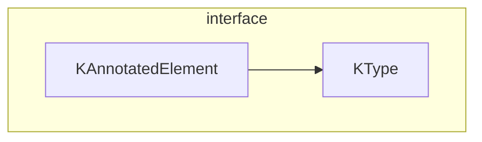
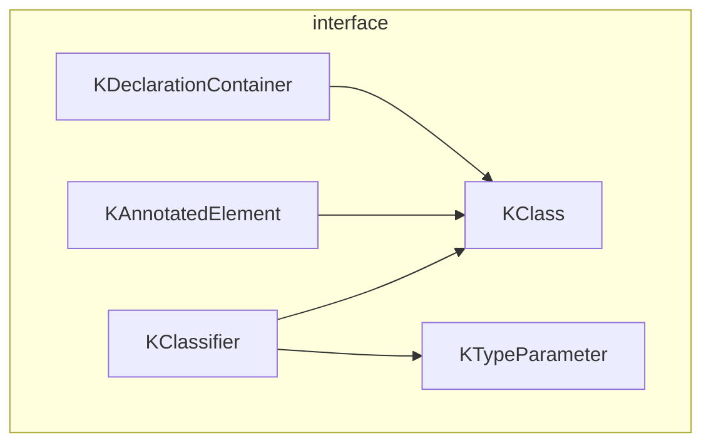

### Kotlin Reflect
#### KAnnotatedElement介绍
    interface KAnnotatedElement
        annotations:List<Annotation>
#### KType介绍
    interface KType
        isMarkNullable:Boolean
        //kotlin 不支持java8的交集类型
        classifier:KClassifier?
        //该类型是否含有泛型信息
        arguments:List<KTypeProjection>

#### KClassifier介绍
    interface KClassifier 
    有两种类型，一种是Class类型，一种是类型参数；因此有两个子类
    KClass ,KTypeParameter。

##### <li> KClass
    interface KClass
        simpleName:String?
        qualifyName:String?
        fun isInstance(any?):Boolean
##### <li> KTypeParameter
    interface KTypeParameter
        name:String？
        upperBounds:List<KType>
        variance:KVariance
        isReified:Boolean
    
    enum class KVariance
        IN //逆变
        OUT //协变
        INVARIENT //固定不变的

#### KDeclarationContainer
    interface KDeclarationContainer
        members:List<KCallable<*>>

    interface KCallable<Out E>
        name:String
        parameters:List<KParameter>
        returnType:KType
        typeParameters:List<KTypeParameter>
        visibility:KVisibility?
        isAbstract:Boolean
        isOpen:Boolean
        isSuspend:Boolean

    interface KParameter
        index:Int //在paramters所在的位置
        name:String?
        type:Ktype
        kind:Kind
        isVararg:Boolean
        isOptional:Boolean

    enum class Kind
        INSTANCE
        RECIEVER
        VALUE
        
#### KTypeProjection 介绍
    类型投影
    class KTypeProjection
            variance:KVariance? //型号投影返回为null
            type:KType? //型号投影返回为null

#### ps

