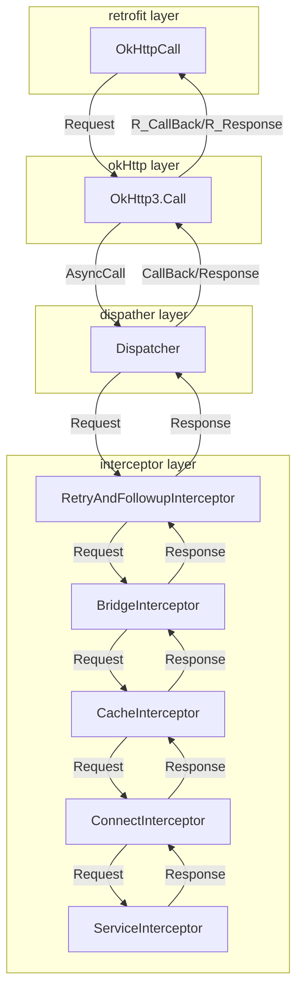

### Retrofit 框架分析
#### 体系简介

```mermaid
graph TD

subgraph retrofit layer
OkHttpCall  
end

subgraph okHttp layer
OkHttp3.Call
end

subgraph dispather layer
Dispatcher
end

subgraph interceptor layer
RetryAndFollowupInterceptor  --Request--> BridgeInterceptor
 --Request--> CacheInterceptor --Request--> ConnectInterceptor --Request--> ServiceInterceptor
 
ServiceInterceptor --Response--> ConnectInterceptor --Response --> CacheInterceptor
--Response-->BridgeInterceptor --Response-->RetryAndFollowupInterceptor
end

OkHttpCall --Request--> OkHttp3.Call --AsyncCall--> Dispatcher --Request--> RetryAndFollowupInterceptor

RetryAndFollowupInterceptor --Response--> Dispatcher --CallBack/Response--> OkHttp3.Call
--R_CallBack/R_Response-->OkHttpCall
```