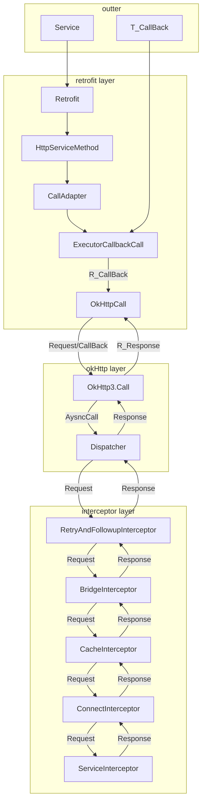

### Retrofit 框架分析

#### 体系简介

#### Retrofit层的作用
##### <li> 初始换Retrofit配置
    如配置host,添加自定义拦截器，请求/相应转换器，ssl证书管理器配置
##### <li> 封装Request
    通过反射获得service的方法信息以及注解信息，从而封装网络请求所需的信息。
##### <li> 选择合适的模式
    目前支持Java8以上的Future模式，RxJava的Observable模式，Kotlin的协程模式，以及普通的Call模式。
    根据是否是supend方法，返回类型信息可以自动选取合适的模式。

    针对不同的模式callAdapter会对OKhttpCall做不同的转换，对于普通的Call模式，会转换成
    ExcutorCallBackCall,作用是将OKHttpCall的监听到的数据状态变化，从工作线程，切换到
    Ui线程，进行相应的回调。
##### <li> 构建OkHttpCall实现网络请求
    OkHttpCall是通过OkHttp层的OKhttp3.Call来实现的

    
