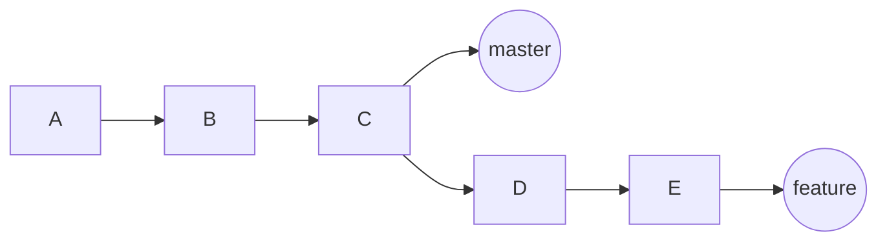
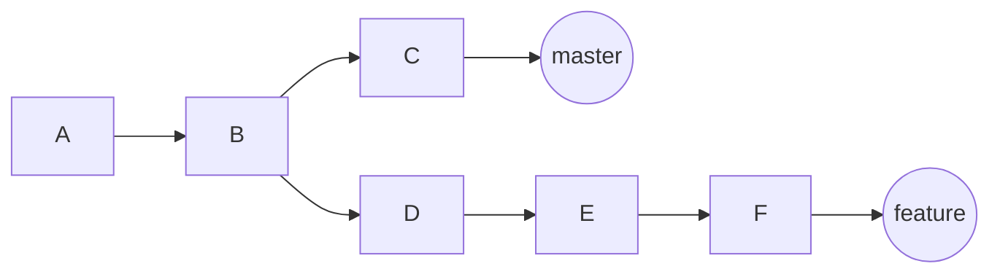

### git
#### 基本概念
    git可以分为三个区域，工作区，暂存区，仓库区。

    我们通过git add file ,或者 git add -A
    或者 git add * ,将某个文件，或者所有新建的文件，
    以及变动的文件，从工作区添加到暂存区。
    
    git commit 将暂存区的文件 添加到仓库区。
#### 撤销操作
##### <li> 仓库区的撤销
    git commit --amend 
    若当暂存区有改动的文件，可以添加到最近的一次提交，并对最近的一次提交信息进行编辑。
    若当暂存区没有改动文件，可以修改最近一次提交的信息。
    
    git rebase -i commit 
    可以修改commit 之后的若干次提交，可以针对每次提交进行信息编辑，放弃本次提交，
    合并到上一次提交。

##### <li> 暂存区的撤销
    git reset HEAD file /git restore file
    将file的文件改动从暂存区移除

##### <li> 工作区的撤销
    git checkout file
    撤销文件的本次修改

#### 分支管理
##### <li> 分支创建
    git branch br_name 创建br_name分支，但是不切换到br_name分支
    git checkout -b br_name 创建br_name分支，并且切换到br_name分支

##### <li> 分支查询
    git branch -a 远程和本地分支
    git branch -r 远程分支
    git branch  本地分支
    git branch --list <pattern> 符合pattern的分支
    git branch --merged commit 合并过的分支
    git branch --no-merged commit 

##### <li> 分支修改或者删除
    git branch -d br_name 
    如果br_name分支设置upstream ，那么br_name必须合并到upstream分支，才能删除。
    
    git branch -D br_name
    强制删除br_name分支
    
    git branch -m odl_name new_name
    //移动或者修改old_name为new_name 和相应的reflog
    
    git branch -M old_name new_name
    //强制移动或者修改old_name为new_name

      git branch -c odl_name new_name
    //复制old_name为new_name 和相应的reflog
    
    git branch -M old_name new_name
    //强制复制old_name 到new_name
    
##### <li> 分支设置upstream
    git branch -u br_new_name
    为当前分支设置 上游分支br_new_name
##### <li> 分支合并
    git merge topic 
    //将分支topic合并到当前分支
    --ff 默认行为，在满足 fast-fowrd 的条件下不创建merge commit 提交记录，
    如下图，feature分支合并到master分支的情况下，满足fast-forward的条件

    --commit 默认行为，在不满足fast-forward的情况下，如果也没有冲突，会自动合并，而且
    提交merge记录
    --no-commit 在不满足fast-forward的情况下，如果没有冲突处理，不会自动提交合并记录，
    需要手动 git commit 提交合并

    --edit 默认行为 在提交合并记录的情况下允许你修改消息之后，在提交合并请求
    --no-edit 在提交合并记录的情况下自动添加合并记录信息

    --squash 如下图 git merge --squash feature 该命令会将 D ,E，F
    的三次提交合并为一次提交，合并到master分支。

##### <li> 分支远程推送
    git push origin -u master
    推送master分支到远程库，并且设置remotes/origin/master该远程分支为上游（upstream）

    git push origin --delete feature_tmp master
    推送分支 feature_tmp合并到远程maser分支，并且删除分支feature_tmp

    
    
    

    