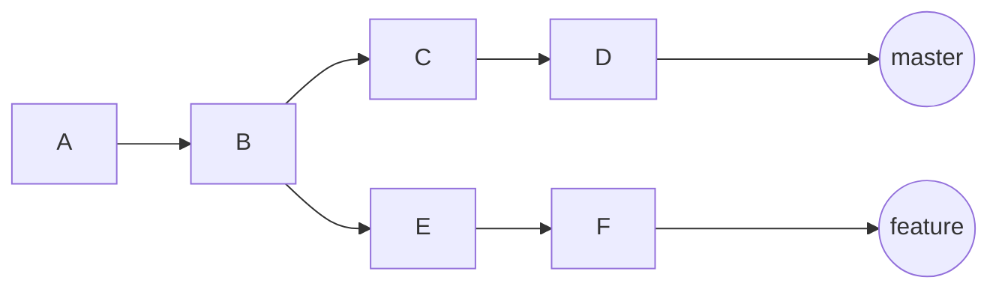
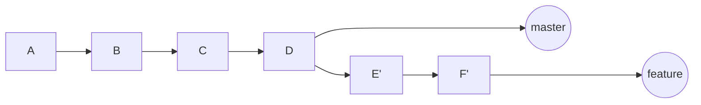

### Rebase
#### Rebase的作用
    rebase的作用有二，其一是通过变基，实现代码合并的提交记录，更简洁，而且没有分叉。其二，修改已经提交的记录。

#### 变基

当前分支如下图

经过 rebase如下命令之后
```text
git checkout feature
git rebase master
```
得到新的提交记录



#### Rebase 命令解析
    git rebase --onto D master feature

    --onto [commit] 表示从那个点作为变基之后的起点，以上的例子有两个备用点，C 或者 D.若不指定，取决于
    上游（master）的HEAD。

    master 表示upstream ，表示当前分支的参照分支，也可以是有效的commit 。
    feature 是表示进行的变基的分支，如果在此分支上可以省略。
    
    
    git rebase -i HEAD~3 用于修改已提交的若干记录
    -i 表示修改 若干次的提交记录
    HEAD~3 表示某个commit提交记录ID

#### ps
    使用rebase 是有风险的，请谨记不要rebase自己之外的分支。分支必须是自己单独使用，才能使用rebase.


