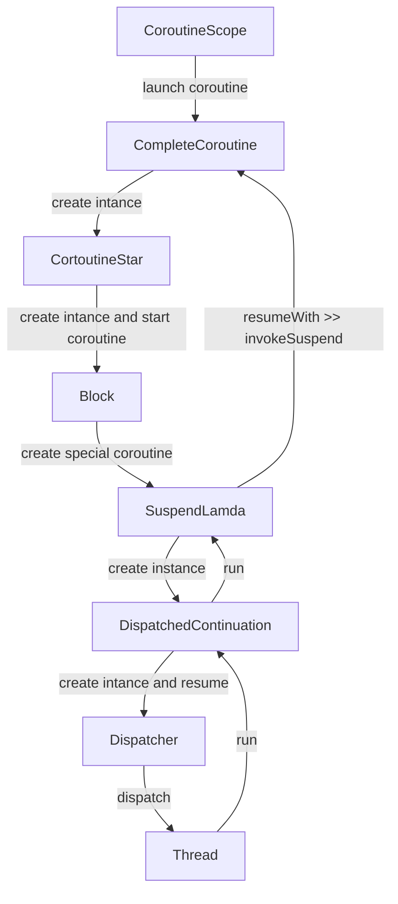

### kotlin 协程源码分析

#### 开启协程调用流程

#### CompleteCoroutineLayer分析

    在CompleteCoroutineLayer层,如果是调用的RunBlocking启动协程，对应的BlockingCoroutine;
    如果是调用launch启动协程，对应的是StandaloneCoroutine;如果是async启动的协程，对应的是
    DeferedCoroutine;对于这一层的协程，都会继承于AbstractCoroutine这个基类。
    
    这个AbsractCoroutine这个基类的作用是创建协程，提供了重要的方法start(CoroutineStart,
    CompleteCoroutine,block)。这个方法事实上是通过CoroutineStart启动协程的，因此本层的
    主要作用指定了协程的启动模式和CoroutineContext中的ContinuationInterceptor--也就是
    Dispatcher.
    
    CoroutineStart决定创建什么类型的协程，是否支持取消的，直接在当前协程创建协程（不会切换到其他线程）
    是否是延迟的；最终由block来创建协程；block是挂起函数，根据不同的CoroutineStart，对block这种挂
    起函数进行了扩展，以便让block可以启动不同的协程。例如可取消的调用block.startCoroutineCancellable
    (CompleteCoroutine,CompleteCoroutine)

#### SuspendLamda分析

    block启动线程的步骤有二步，第一步createCoroutineUnintercepted(CompleteCoroutine,
    CompleteCoroutine)，创建未拦截的协程，这个是真正的协程实现，有BaseCoroutineImpl；
    CompleteCoroutine主要作用是作为构造协程SuspendLamda子类的参数，以及作为协程执行状态的回调。
    该SuspendLamda的子类生成由Kotlin编译器进行的。这个SuspendLamda的子类有一个重要的方法invoke
    supend()这个方法，就是我们执行block的地方。SuspendLamda本身继承BaseCoroutineImpl.
    
    第二步SuspendLamda作为参数构建DispathedContinuation，并且调用DispatchedContinuation的
    resume方法。
    
    DispatchedContinuation任务在线程执行的时候，会调用run方法，该方法内会调用SuspendLamda的
    resumenWith()方法，该方法内会调用invokeSuspend(）方法，该方法会执行block的内容取得结果之后
    调用CompletedCoroutine的resumeWith()方法

#### DispatchedContinuation

    DispatchedContinuation实现了Runnable,主要作用是通过CoroutineContext中的
    ContinuationInterceptor(即dispatcher)将本身交给相应的线程，来执行run方法。
    
    DispatchedContinuation的run方法主要是调用SuspendLamda的resumeWith()方法
