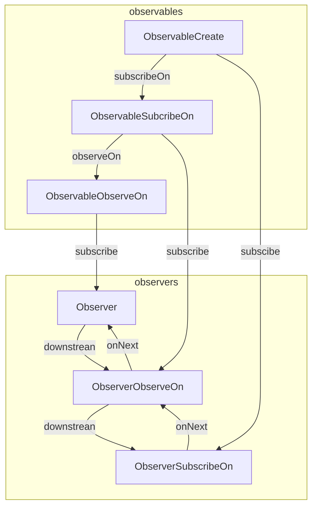

### 响应式编程
#### <li> 响应式编程数据模型
    响应式编程是基于Push类型的数据流模型。铺设好数据流管道，然后在合适的时机，数据通过管道传给订阅者。
    是立足于数据生产者。这是与传统的pull类型数据流模型最大的区别。
#### <li> RxJava 响应编程库分析
    是由奈飞公司开发的响应扩展库。基于Observable流，我们可以对Observable进行不同的组合。每一个
    Observable，可以认为是一个异步或者同步操作，根据业务场景我们可以对这些操作进行组合得到新的操作
    即新的Observable.组合Observable，帮我们解决了复杂的业务场景，我只关心业务即可，组装的实现库
    已经帮我们做好了。

    这个库是基于事件编程的，我们将异步操作和同步操作统一起来，避免CallBack地狱
    这种情况，极大的提高了代码的可读性。
    
    该库的特性：
        1>即时响应 任务操作的失败，外部的网络断开，都能够即时的通知给订阅者
        2>弹性 在不同的负载下，系统的吞吐效率是一致的。
        3>回压机制 正常情况下数据流的流动速度取决于，生产者产生数据的速度，但是当订阅者处理数据
        数据慢的时候，生产者会放慢生产的速度。

#### <li> RxJava库的实现思路

