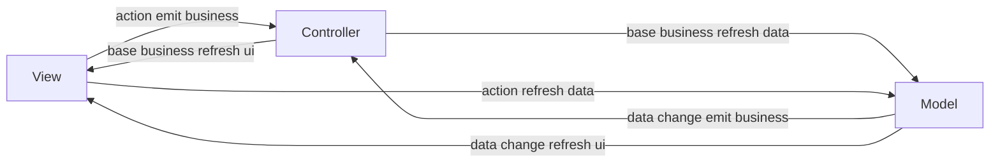
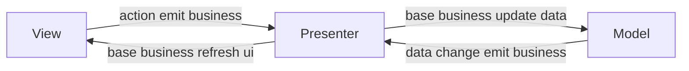
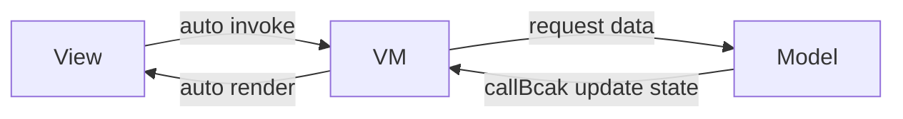
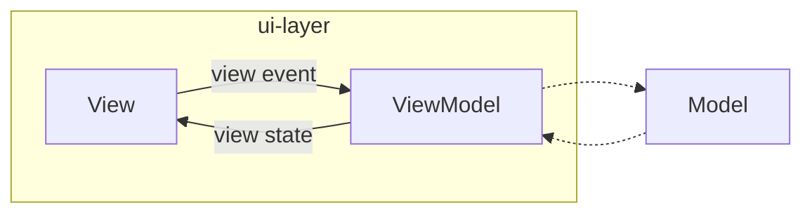

#### 开发架构

##### <li> 架构简介

    android开发的架构有MVC,MVP,MVVM以及现在的MVI.Android框架选择聚焦于
    分离关注点，数据驱动

##### <li> MVC

    Model层，主要负责数据获取，存储，访问。数据主要是应用业务逻辑的状态。

    View层主要是布局Xml以及Activity的Ui动态代码。

    Controller层是业务逻辑控制层。主要作用接收View层的action或者model
    层的数据变化,更新View层相应的UI或者更新Model层相应的业务逻辑状态。
    
    MVC主要缺点
    1.Model层与View层耦合，造成Model 层无法复用。
    2.Activity包含Controller和View层的代码容易边界模糊，随着业务的更迭，
      Activity显得很臃肿。

    ps:action包括编辑信息动作，点击动作，手势动作。

事件流向图

##### <li> MVP
    相对于MVC,实现了Model和View的解耦，Activity主要作为View的角色,Activity大大减负,
    Presenter持有View的接口和model,随着业务迭代，View的接口会很庞大。

MVP 事件流向图

##### <li> MVVM
    Model是业务数据模型，涉及网络请求，本地数据缓存以及访问
    ViewModel是包含视图数据模型，视图数据修改规则，依赖双向绑定可以自动渲染到View。
    View层是布局文件，通过双向绑定，view的数据变化，可以自动通知ViewModel
    
    MVVM实现可以通过DataBinding 或者LiveData两套机制。DataBinding是双向绑定，
    LiveData是单一数据源。
    
    MVVM可以看成是MVP的数据自动渲染的自动化，也就避免了大量了的View接口。
    MVVM如果的视图数据太多，为了保证单向数据流（UDF),就要写很多模板LiveData。
    

###### <li> MVI
    
    无论是view  envent 还是 view state 都是Intent,在View 和ViewModel之间流动，
    View 和ViewModel之间的数据流动是单向的。

    MVI 对View State 进行集中化处理，可以避免基于LiveData的MVVM那么多的State模板代码
    MVI 强调单向数据流，保证了数据一致性，可测试性（独立于界面）
