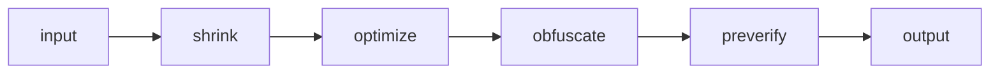

### Proguard_Rule
    主要是为了对 shrink optimization obfucate verify这几种行为进行配置  

    1.shrink阶段 寻找Entry点（例如main方法的class），如果有EntryPoint,设置了-keep 选项，-keepclassmembers
    选项，-keepclasswithmembers选项的class名称和指定class成员不会被压缩，以及Entry方法中所有使用的class以及
    class成员，其他未使用的class成员会被丢弃，但是class的名称不会被丢弃。
    如果没有EntryPoint，设置了-keep选项以及-keepclasswithmembers的class名称和指定class成员不会被丢弃，
    其他class的会被丢弃。

    2.optimization阶段 对于不在Entry点的方法可以private ,对于没有使用的方法参数可以移除掉，一些
    方法可以被内联掉。

    3.obfucate阶段 对于Entry点的方法不进行混淆，以及配置了-keep选项，-keepclassmembers,-keep
    classwithmebers选项的class以及指定的class成员不进行混淆
    4. preverify阶段
#### <li>流程图

#### <li> 通配符号
    modifier 是指public private protected abstract final static
    class_specification 是指 class *class_name* extends superclas_full_name
    或者 interface * extends super_interface_full_name
    或者 class * implements super_interface_full_name
    或者包含成员的定义例如
    class * extends java.lang.String{
        native void <methods>
    }
#### <li>keep 行为
    该行为主要是为了对混淆行为进行配置。
##### -keep [modifier]class_specification
    对于满足条件的class,指定类的名称以及指定的成员不进行混淆和压缩，其他成员进行混淆和压缩（甚至移除）
    因此对于应用的入口要采用-keep选项
    
     -keep public class * extends java.lang.String
    对于继承String的class以及其成员变量与成员方法不进行混淆和压缩

##### -keepclassmembers 【modifier】class_specification
    对于满足条件的class存在的情况下，对于指定的类的成员变量和成员方法不进行混淆和压缩
##### -keepclasswithmembers 【modifier】class_specification
    必须具备所有指定的成员的class以及成员不进行混淆和压缩

##### -keepnames  class_specification
    对于指定的class 以及成员的名称不进行混淆，但是可以进行压缩
##### -keepmembernames class_specification
    对于指定class的成员的名称不进行混淆，但是可以进行压缩

##### -keepclasswithmembers class_specification
    必须具备所有指定的成员的class以及成员不进行混淆但是可以压缩

#### -keepattributes 
    对于一些属性不进行混淆
    
    -keepattributes Exceptions,InnerClasses,Signature,Deprecated,
                SourceFile,LineNumberTable,*Annotation*,EnclosingMethod
    对异常，内部类，签名，注解等属性不进行混淆

#### ps
一个class 主要包含变量和方法，但也会包含其他属性（attribute）例如行号，字节码，源码文件名称

通配符号 ？代表单个字符； *代表任意连续的字符，但不包含包的分割符号； ** 代表任意的字符包含包分割符号

对于没有应用入口的jar包，压缩器会移除掉没有被-keep选项的的类，包括-keepclassmembers 选项的类。

    