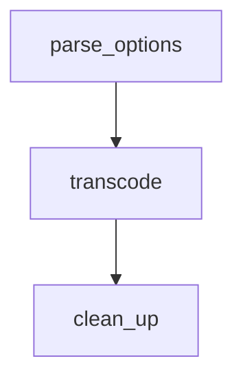
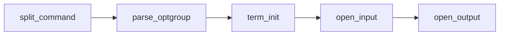
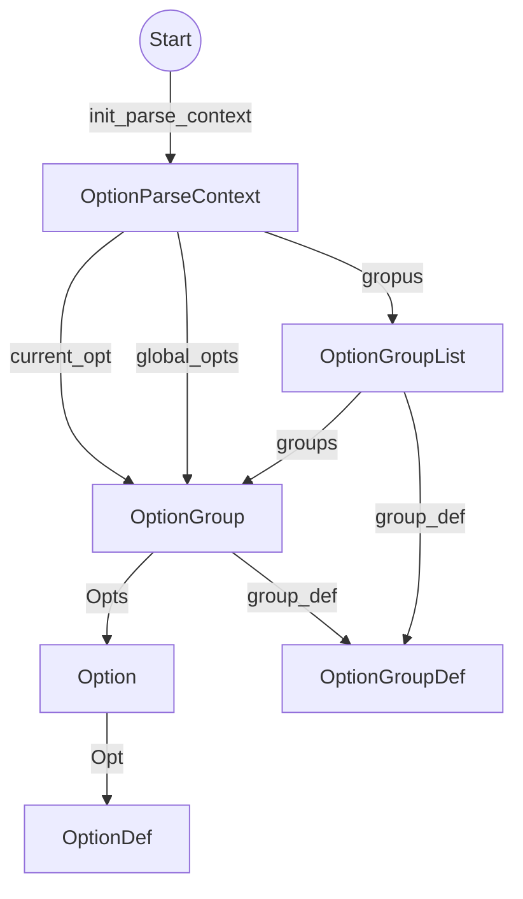

#### <li> ffmpeg 解析配置选项源码分析
转换格式的流程图

#### <li> 解析选项配置分析

split_command分析

    1.为OptionParseContext分配内存，并且初始化成员变量nb_groups,并且根据nb_groups大小
        为成员变量groups分配内存，并且遍历每个OptionGroup,为其成员变量group_def赋值。其
        次为成员变量global_opts赋值，
    2. 遍历输入参数进行分析，解析出选项以及选项值，将选项设置到OptionParseContext中对应的
        groups中的某个OptionGroup中


    init_parse_context(optionParseContext*,groups*,nb_groups)
        groups是外部定义号的静态变量OptionGroupDef[]，分为两组，input和
        output组。nb_groups的大小为2
        该方法主要是为optionParseContext分配内存和初始化其成员变量groups
        (主要是OptionGroupList的group_def),nb_group,以及global_opt
    
    finish_group(optionParseContext*,group_index,arg)
        group_index 表示静态变量groups（OptionGroupDef[]）中所在的位置
        arg 表示 参数的值例如output的文件路径
        该方法的主要作用是为optionParseContext的成员变量groups对应的group_index
        元素（OptionGroupList。对OptionGroupList的groups,增加一个元素，
        并且对该元素进行初始化。
        有n个输入或者输出文件，那么对应的OptionGroupList中groups对应多少个
        OptionGroup。
    
    add_opt(optionParseContxt*,optDef*,key*,value*)
        key 表示配置项 例如 ss 表示设置开始时间
        value表示配置项的值
        optDef:OptionDef 根据其flags判断是否是全局配置
        若是全局配置，将新生成的Option 添加到optionParseContext的global_opts->opts中
        否则将新生成的Option，添加到optionParseContext的current_group->opts中

open_input/output

    OptionParseContext一般nb_groups为2，groups中包含input和output两类配置选项
    该方法主要作用是遍历上述配置类型，执行一下操作
    a.遍历每个配置类型的所有选项组，在其中初始化OptionContext,并对其成员变量start_time,
        stop_time,recording_time,accurate_seek ,mux_max_delay,limit_file_size
        以及g进行赋值
    b.根据OptionContext打开相应的文件操作（input/output）
        如果是input
        1>av_find_input_format(optionContext->format)
        2>avformat_alloc_context()
        3>avformat_open_input
        4>为每个avformatContext中的stream选择合适的解码器
        avcodec_find_decoder(st->codecpar->codec_id)
        5>给静态变量inputstreams添加新的stream
        6>给静态变量inputFiles添加新的file
        
        如果是output
        1>为静态变量outfiles添加新的file
        2>创建对应的outputstream

#### <li> 主要实体结构
##### OptionParseContext
    global_opts:OptionGroup
    groups:OptionGroupList*
    nb_groups:int 
    cur_group:OptionGroup
##### OptionGroupList
    group_def:const OptionGroupDef*
    gropus:OptionGroup*
    nb_groups:int
#### OptionGroup
    group_def:OptionGroupDef*
    arg :const char*
    opts:Option*
    nb_opts:int
    codec_opts:AVDictionary*
    format_opts:AVDictionary*
    resample__opts:AVDictionary*
    sws_dict:AVDictionary*
    swr_opts:AVDictionary*

##### Option
    opt:const OptionDef*
    key:const char*
    val:const char*
    
#### OptionDef
    typedef struct OptionDef {
    const char *name;
    int flags;
    #define HAS_ARG    0x0001
    #define OPT_BOOL   0x0002
    #define OPT_EXPERT 0x0004
    #define OPT_STRING 0x0008
    #define OPT_VIDEO  0x0010
    #define OPT_AUDIO  0x0020
    #define OPT_INT    0x0080
    #define OPT_FLOAT  0x0100
    #define OPT_SUBTITLE 0x0200
    #define OPT_INT64  0x0400
    #define OPT_EXIT   0x0800
    #define OPT_DATA   0x1000
    #define OPT_PERFILE  0x2000     /* the option is per-file (currently ffmpeg-only).
                                       implied by OPT_OFFSET or OPT_SPEC */
    #define OPT_OFFSET 0x4000       /* option is specified as an offset in a passed optctx */
    #define OPT_SPEC   0x8000       /* option is to be stored in an array of SpecifierOpt.
                                       Implies OPT_OFFSET. Next element after the offset is
                                       an int containing element count in the array. */
    #define OPT_TIME  0x10000
    #define OPT_DOUBLE 0x20000
    #define OPT_INPUT  0x40000
    #define OPT_OUTPUT 0x80000
         union {
            void *dst_ptr;
            int (*func_arg)(void *, const char *, const char *);
            size_t off;
        } u;
        const char *help;
        const char *argname;
    } OptionDef;


#### OptionContext
    typedef struct OptionsContext {
        OptionGroup *g;
    
        /* input/output options */
        int64_t start_time;
        int64_t start_time_eof;
        int seek_timestamp;
        const char *format;
    
        SpecifierOpt *codec_names;
        int        nb_codec_names;
        SpecifierOpt *audio_channels;
        int        nb_audio_channels;
        SpecifierOpt *audio_sample_rate;
        int        nb_audio_sample_rate;
        SpecifierOpt *frame_rates;
        int        nb_frame_rates;
        SpecifierOpt *frame_sizes;
        int        nb_frame_sizes;
        SpecifierOpt *frame_pix_fmts;
        int        nb_frame_pix_fmts;
    
        /* input options */
        int64_t input_ts_offset;
        int loop;
        int rate_emu;
        int accurate_seek;
        int thread_queue_size;
    
        SpecifierOpt *ts_scale;
        int        nb_ts_scale;
        SpecifierOpt *dump_attachment;
        int        nb_dump_attachment;
        SpecifierOpt *hwaccels;
        int        nb_hwaccels;
        SpecifierOpt *hwaccel_devices;
        int        nb_hwaccel_devices;
        SpecifierOpt *hwaccel_output_formats;
        int        nb_hwaccel_output_formats;
        SpecifierOpt *autorotate;
        int        nb_autorotate;
    
        /* output options */
        StreamMap *stream_maps;
        int     nb_stream_maps;
        AudioChannelMap *audio_channel_maps; /* one info entry per -map_channel */
        int           nb_audio_channel_maps; /* number of (valid) -map_channel settings */
        int metadata_global_manual;
        int metadata_streams_manual;
        int metadata_chapters_manual;
        const char **attachments;
        int       nb_attachments;
    
        int chapters_input_file;
    
        int64_t recording_time;
        int64_t stop_time;
        uint64_t limit_filesize;
        float mux_preload;
        float mux_max_delay;
        int shortest;
        int bitexact;
    
        int video_disable;
        int audio_disable;
        int subtitle_disable;
        int data_disable;
    
        /* indexed by output file stream index */
        int   *streamid_map;
        int nb_streamid_map;
    
        SpecifierOpt *metadata;
        int        nb_metadata;
        SpecifierOpt *max_frames;
        int        nb_max_frames;
        SpecifierOpt *bitstream_filters;
        int        nb_bitstream_filters;
        SpecifierOpt *codec_tags;
        int        nb_codec_tags;
        SpecifierOpt *sample_fmts;
        int        nb_sample_fmts;
        SpecifierOpt *qscale;
        int        nb_qscale;
        SpecifierOpt *forced_key_frames;
        int        nb_forced_key_frames;
        SpecifierOpt *force_fps;
        int        nb_force_fps;
        SpecifierOpt *frame_aspect_ratios;
        int        nb_frame_aspect_ratios;
        SpecifierOpt *rc_overrides;
        int        nb_rc_overrides;
        SpecifierOpt *intra_matrices;
        int        nb_intra_matrices;
        SpecifierOpt *inter_matrices;
        int        nb_inter_matrices;
        SpecifierOpt *chroma_intra_matrices;
        int        nb_chroma_intra_matrices;
        SpecifierOpt *top_field_first;
        int        nb_top_field_first;
        SpecifierOpt *metadata_map;
        int        nb_metadata_map;
        SpecifierOpt *presets;
        int        nb_presets;
        SpecifierOpt *copy_initial_nonkeyframes;
        int        nb_copy_initial_nonkeyframes;
        SpecifierOpt *copy_prior_start;
        int        nb_copy_prior_start;
        SpecifierOpt *filters;
        int        nb_filters;
        SpecifierOpt *filter_scripts;
        int        nb_filter_scripts;
        SpecifierOpt *reinit_filters;
        int        nb_reinit_filters;
        SpecifierOpt *fix_sub_duration;
        int        nb_fix_sub_duration;
        SpecifierOpt *canvas_sizes;
        int        nb_canvas_sizes;
        SpecifierOpt *pass;
        int        nb_pass;
        SpecifierOpt *passlogfiles;
        int        nb_passlogfiles;
        SpecifierOpt *max_muxing_queue_size;
        int        nb_max_muxing_queue_size;
        SpecifierOpt *guess_layout_max;
        int        nb_guess_layout_max;
        SpecifierOpt *apad;
        int        nb_apad;
        SpecifierOpt *discard;
        int        nb_discard;
        SpecifierOpt *disposition;
        int        nb_disposition;
        SpecifierOpt *program;
        int        nb_program;
        SpecifierOpt *time_bases;
        int        nb_time_bases;
        SpecifierOpt *enc_time_bases;
        int        nb_enc_time_bases;
    } OptionsContext;

#### split_command 入参详解
    static const OptionGroupDef groups[] = {
        [GROUP_OUTFILE] = { "output url",  NULL, OPT_OUTPUT },
        [GROUP_INFILE]  = { "input url",   "i",  OPT_INPUT },
    };


##### InputFile
    ctx:AVFormatContext*
    ist_index:int //该输入文件的第一个流在静态变量input_streams中的位置
    nb_streams:int//该输入文件的流的数量
    eof_reached:int
    eagain:int
    loop:int
    duration:int64_t
    time_base:AVRational
    input_ts_offset:int64_t
    ...

##### InputStream
    file_index:int
    st:AVStream*
    decoding_needed:int
    dec_ctx:AVCodecContext*
    dec:AVCodec*
    decoded_frmame:AVFrame*
    filter_frame:AVFrame*
    start:int64_t
    next_dts:int64_t
    dts:int64_t
    next_pts:int64_t
    pts:int64_t
    nb_samples:int64_t//每帧样品数量
    decoder_opts:AVDictionary*
    framerate:AVRational
    autorate:int
    filters:InputFilter**
    nb_filters:int
    datq_size:uint64_t//已经读取的packet的大小
    nb_packets:uint64_t//已读取的packet的数量
    frames_decoded:uint64_t //已经解码的frame的数量
    samples_decodes:uint64_t//已经解码出样品数量
    dts_buffer:int64_t*
    nb_dts_buffer:int
    got_output:int
    
    
    
##### OutputFile
    ctx：AVFormatContext*
    opts:AVDictinary*
    ost_index
    recording_time:int64_t
    start_time:int64_t
    limmit_filesize:uint64_t
    header_written:int
    

#### OutputStream
    file_index:int
    index:int //该流在输出文件中所有流的的索引值
    source_index:int//在静态变量input_streams中的索引值
    st:AVStrean*
    encoding_neede:int
    frame_number:int
    sync_list:Struct InputStream*
    sync_opts:int64_t
    first_pts:int64_t
    last_mux_dts:int64_t//装包时间戳
    mux_timebase:AVRational
    enc_timebase:ACRational
    nb_bitstream_filter:int
    bsf_ctx:AVBSFContext**//过滤
    enc_ctx:AVCodecContext*
    ref_par:AVCodecParameter*
    enc:AVCodec*
    max_frames:int64_t
    filtered_frame:AVFrame*
    last_frame:AVFrame*
    last_dropped:int
    last_nb0_frames:int[3]//??
    frame_rate:AVRational
    is_cfr:int
    frame_apect_ratio:AVRational
    ...
    

#### ps
```
表示在现有数组的基础上，增加一个元素的大小
GROW_ARRAY(l->groups, l->nb_groups); 

静态变量input_files/nb_input_files 和 input_streams/nb_input_streams
    ffmpeg是支持多个输入文件进行转码工作，因此这些信息都保存在input_files 和nb_input_files。
    而且每个输入文件可以包含多个流，所有的文件流都保存在静态变量input_streams中
    
OptionDef 为每一个选项在OptionsContext中的位置定义好了一个OffSet。
每一组OptionGroupList 对应一个OptionsContext

```