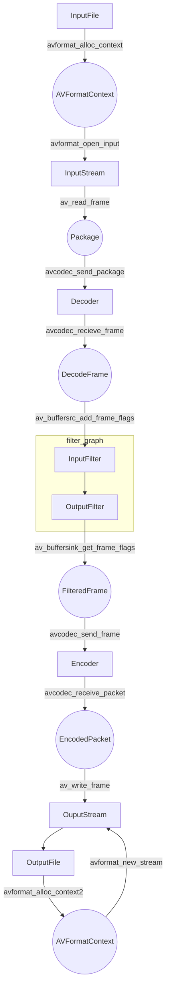

### 转码过程源码分析
##### <li>整体流程

##### 流程分析
    1.在解析配置阶段 主要工作是初始化OutputStream和InputStream
     对于InputStream 
        a.avformat_alloc_context 创建AVFormatContext
        b.avformat_open_input 创建InputStream
    对于OutputStream
        a.avformat_alloc_context2 创建AVFormatContext
        b.avformat_new_stream 创建OutputStream
    2.转码阶段
        av_read_frame 从InputStream中读取RawPacket
        avcodec_send_packet 将RawPacket交给解码器进行解码
        avcodec_recieve_frame从解码器中获得DecodedFrame
        av_buffersrc_add_frame_flag将DecodeFrame交给FilterGraph进行滤镜处理
        av_buffersing_get_frame_flag从FilterGraph滤镜处理中获得FilteredFrame
        avcodec_send_frame 将FilteredFrame交给编码器进行编码
        avcodec_recieve_packet从编码器中获得EncodedPacket
        av_write_frame将EncodesPacket写入OutputStream保存到OutputFile中
    

#### <li> 实体类
##### FilterGraph
    index:int //在静态变量filtergraphs中所处的位置
    graph_desc:const char*
    graph:AVFilterGraph*
    inputs:InputFilter**
    nb_inputs:int
    outputs:OutputFilter**
    nb_outs:int
    reconfiguration:int
##### OutputFilter
    filter:AVFilterContext*
    ost:OutputStream*
    graph:FilterGraph*
    name:uint8_t
    out_tmp:AVFilterInOut*
    width:int
    height:int
    frame_rate:AVRational
    sample_rate:int
    format:int
    channel_layout:uint64_t
    formats：int*
    channel_layouts:uint64_t*
    sample_rates:int*
    
    

#### <li> ps
    静态变量filtergraphs和nb_filtergraphs
    
