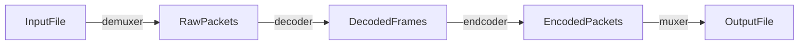
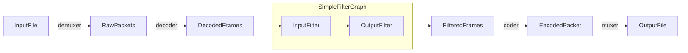
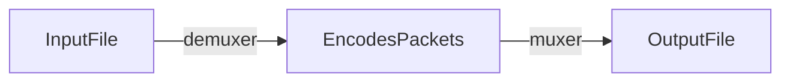

### ffmpeg 手册
#### <li> 简介
ffmpeg 是一个音频和视频的转换器。它可以有多个输入源，这些输入可以是
文件，pipe管道流，网络流，设备中采集。通过-i 选项指定。转换之后可以
输出到多个输出源，这些输出源同样可以是文件，网络，设备，pipe管道流。

每个输入源（InputFile）或者输出源(OutputFile)可以不同类型的流，包
括Video,Audio,Subtitle,data,attachment),不同的容器类型对流的
类型会有限制，例如MP3容器不可能包含视频流。

输入选项配置应用到紧跟的输入源或者输出源，当然全局选项配置除外。
全局配置选项位于首位。
```text
ffmpeg -y -i input.mp3 -map 0:a:1 -c:a:1 aac -o output.aac
-y 是全局选项 表示可以覆盖已经存在的输出文件
```
#### <li> 转码流程图


#### <li> 滤镜流程图


```text
上面是简单的滤镜流程，对于复杂的滤镜选项使用-complex_filter 选项，复杂的滤镜 是指在不止一个输入的情况下，
进行滤镜处理，或者输出流的类型和输出流的类型不一致。复杂滤镜配置是全局的
```
#### <li> 流的复制流程图

    流的复制没有解码和编码的过程，
    ffmepg -i input.flac -codec copy output.flac
#### <li> stream的选择
```text
ffmpeg -i input.mp4 -map 0:a:1 output.mp3
-map 用于人为选择输入到output的流 0:a:1 表示第一个输入文件的第二个音频流输出到output.mp3
对于输出容器支持的流的类型，如果不设置该选项就会自动选择流选择的标准如下，
音频流选择信道数量最多的
视频选择分辨率最高的
字幕有基于文字的或者基于图像的，选择符合类型的第一个流
对于data和attachment 不会自动选择，必须人为设置才会输出到output


```

#### <li>常用配置选项
##### -t duration
    音频或者视频的录制时长 对应OptionsContext中的recording_time,单位为
    秒，输入与输出都可以配置该选项
##### -to  time_stop
    音频或者视频录制或者转码的结束时间,对用OptionsContext中的stop_time
    ,输入和输出都可以配置该选项
##### -ss time_off 
    设置开始时间，对应着OptionsContext中的start_time
    输入或者输出都可以配置该选项
##### -sseof 
    设置相对于EOF的开始时间，对应着OptionsContext中的start_time_eof
    输入可以配置该选项

    
    

#### <li> ps 
文件大小 = 比特率 * 时长