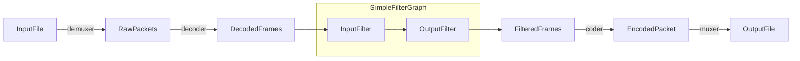

### ffmpeg 手册
#### <li> 简介
ffmpeg 是一个音频和视频的转换器。它可以有多个输入源，这些输入可以是
文件，pipe管道流，网络流，设备中采集。通过-i 选项指定。转换之后可以
输出到多个输出源，这些输出源同样可以是文件，网络，设备，pipe管道流。

每个输入源（InputFile）或者输出源(OutputFile)可以不同类型的流，包
括Video,Audio,Subtitle,data,attachment),不同的容器类型对流的
类型会有限制，例如MP3容器不可能包含视频流。

输入选项配置应用到紧跟的输入源或者输出源，当然全局选项配置除外。
全局配置选项位于首位。
```text
ffmpeg -y -i input.mp3 -map 0:a:1 -c:a:1 aac -o output.aac
-y 是全局选项 表示可以覆盖已经存在的输出文件
```
#### <li> 转码流程图


#### <li> 滤镜流程图

