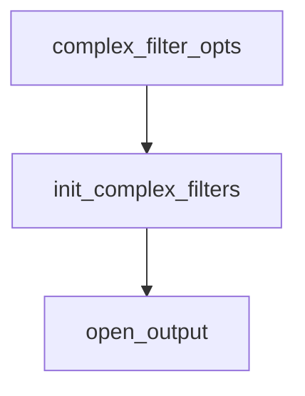

#### 滤镜使用
##### <li> 简介
    滤镜分为简单滤镜和复杂滤镜。简单滤镜只有一个输入和输出并且输入和输出类型一致。简单滤镜
    使用-vf /-af 分别表示视频滤镜、音频滤镜。其他的情况为复杂滤镜，使用-filter_complex
    选项，该选项是全局配置选项。-lavf 等同于 -filter_complex选项。
    
    对于-filter_complex 选项产生的输出流，如果要配合-map选项，只能被指定一次，并且要准确
    所谓准确是指该流被输出容器的格式所支持。
```text
ffmpeg -i input -vf "split[main][tmp];[tmp]crop=iw:ih/2:0:0,vflip[flip];
    [main][flip]overlay=0:H/2" OUTPUT
```


##### <li> 源码分析
```text
ffmpeg -i in.flac -filter_complex 'acrossover=split=1500[LOW][HIGH]'
 -map '[LOW]' low.wav -map '[HIGH]' high.wav
```
上述复杂滤镜选项，在选项解析阶段，会保存到静态变量filtergraphs中，该数组可以保存多个
FilterGraph。然后遍历每个FilterGraph,进行init_complex_filtergraph(FilterGraph)

滤镜方法调用流程

```text
init_complex_filtergraph(FilterGraph *fg){
    AVFilterInOut *inputs,*outputs 表示滤镜链的输入输出
    AVFilterGraph graph* = avfilter_graph_alloc()
    avfilter_graph_parse2(graph,fg->graph_desc,&inputs,&outputs)
    主要作用是根据fg的graph_desc描述构建AvFilterGraph的实例graph,以及初始化
    inputs和outputs
    遍历inputs,为fg->inputs添加新的InputFilter,同时对新添加的InputFilter的
    ist,graph,format,frame_queue进行初始化
    遍历outputs,为fg->outputs添加新的OutputFilter，并且对新增的OutputFilter
    的graph,tmp_out,type,name进行赋值(注意此时并未为OutFilter指定ost)
}

open_output(){
    如果使用了复杂滤镜选项
    遍历每一个复杂的FilterGraph,在对FilterGraph的outputs进行遍历，对没有用-map选项指定
    的标记的OutputFilter,创建相应媒体类型的OutputStream,该OutputStream的source_index
    为-1，表示没有对应的InputStream。将OutputStream设置到OutputFilter上。
    
    如果使用了-map选项的
        如果使用了label
            遍历所有的label 确保与对应的OutputFilter-->out_tmp-->name一致。
            创建OutputStream,其source_index为-1
        没有使用label
            根据map选项选择指定的输入流，并且以此创建OutputStream
    
    
    如果没有使用-map选项
    选出每个媒体类型最合适的InputStream,然后创建对应的OutputStream流，OutputStream的source_index便是
    InputStream在静态变量inputstreams的位置。OuputStream也会放入静态变量outputstreams。
    
    从当前outputfile的ost_index开始，遍历静态变量outputstreams,对每一个source_index>0的OutputStream
    和其对应的InputStream进行init_simple_filtergraph()
    
    
}

复杂的滤镜和简单的滤镜方法不会同时调用的
```

````mermaid

graph TB
subgraph FilterGraph
inputs:InputFilter* -->
BufferSrc 
BufferSink --> outputs:OutputFilter*
end

subgraph AVFilterGraphStructure
    inputs:AVFilterInOut -->
    graph_:AVFilterGraph -->
    outputs:AVFilterInOUt
end

InputFile --> InputStream --> inputs:InputFilter*
BufferSrc --link-->inputs:AVFilterInOut
outputs:OutputFilter* --> OutputStream --> OutputFile
outputs:AVFilterInOUt --link--> BufferSink
````
InputFilter的初始化获取输入流的过程
````mermaid
graph TB
AVFilterInout --name--> file_index --g_inputfiles--> InputFile --ctx-->AVFormatContext
AVFilterInout --filter_ctx-->AVFilterContext--inputpads-->AVFilterPad-->AVMediaType
AVFilterInout-- pad_index-->AVMediaType

AVFormatContext--streams--> AVStream
AVMediaType --> AVStream
AVStream --index-->InputStream
InputFile--ist_index / g_inputstreams-->InputStream

````

#### <li> ps
    FilterGraph
        index:int 在静态变量filtergraphs中的位置
        graph_desc:const char* 这个是对滤镜的具体描述，例如“acrossover=split=1500[LOW][HIGH]”
        graph:AvFilterGraph*
        reconfiguration:int
        inputs:InputFilter**
        nb_input:int
        outputs:OutputFilter**
        nb_outputs:int
    InputFilter
        filter:AVFilterContext*
        ist:InputStream*
        graph:FilterGraph*
        type:AVMediaType
        format:int
        frame_queue:AVFifoBuffer*
        ...
    OutputFilter
        filter:AVFilterContext*
        ost:OutputStream*
        graph:FilterGraph*
        name:uint8_t
        out_tmp:AVFilterInOut*//若其name为空表示没有使用-map选项指定输出到OutputFile
        type:AVMediaType
        ...
    AVFilterInOut
        filter_ctx:AVFilterContext*
        pad_index:int
        name:char* //根据name 可以获得在静态变量inputfiles或者outputfiles中对应file所处的位置
        next:AVFilterInOut*
    AVFilterPad
        name:const char*
        type:AVMediaType
        flags:int*
    AVFilterContext
        inputpads:AVFilterPad*
        inputs:AVFilterLink**
        ...
    AVFilterGraph

    
        
        

    EOF 表示文字流的结尾或者文件的结尾